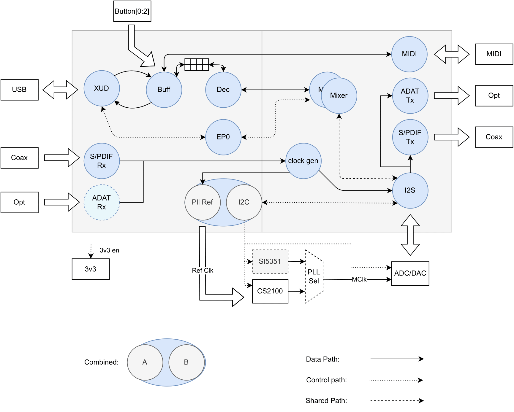

.. _usb_audio_sec_316_audio_sw:

The xcore.ai Multi-Channel Audio Board
======================================

An application of the USB audio framework is provided specifically for the XK_AUDIO_316_MC_AB hardware described in
:ref:`usb_audio_hardware_platforms` and is implemented on an xcore.ai series dual tile device.  The
related code can be found in ``app_usb_aud_xk_316_mc``.

The design supports upto 8 channels of analogue audio input/output at sample-rates up to 192kHz
(assuming the use of I2S). This can be further increased by utilising TDM. It also supports S/PDIF,
ADAT and MIDI input and output as well as the mixing functionalty of ``lib_xua``.

The design uses the following tasks:

 * XMOS USB Device Driver (XUD)
 * Endpoint 0
 * Endpoint Buffer
 * Decoupler
 * AudioHub Driver
 * Mixer
 * S/PDIF Transmitter
 * S/PDIF Receiver
 * ADAT Transmitter
 * ADAT Receiver
 * Clockgen
 * MIDI

The software layout of the USB Audio 2.0 Reference Design running on the
`xcore.ai` device is shown in :ref:`usb_audio_ai_threads`.

Each circle depicts a task running in a single core concurrently with the other tasks. The
lines show the communication between each task.

.. _usb_audio_ai_threads:

     xcore.ai Multichannel Audio System/Core Diagram

Clocking and Clock Selection
----------------------------

As well as the secondary (application) PLL of the `xcore.ai` device the board includes two options for master clock generation:

    * A Cirrus Logic CS2100 fractional-N clock multiplier allowing the master clock to be generated from a
      xCORE derived reference.
    * A Skyworks Si5351A-B-GT CMOS clock generator.

The master clock source is chosen by driving two control signals as shown below:

+--------------+-----------+---------------------------------------+
| Control Signal           | Master Clock Source                   |
+--------------+-----------+                                       |
| EXT_PLL_SEL  | MCLK_DIR  |                                       |
+==============+===========+=======================================+
| 0            | 0         | Cirrus CS2100                         |
+--------------+-----------+---------------------------------------+
| 1            | 0         | Skyworks SI5351A-B-GT                 |
+--------------+-----------+---------------------------------------+
| X            | 1         | xcore.ai secondary (application) PLL  |
+--------------+-----------+---------------------------------------+

Each of the sources have potential benefits, some of which are discussed below:

- The Cirrus CS2100 simplifies generating a master clock locked to an external clock (such as S/PDIF in or word clock in).

  * It multiplies up the PLL_SYNC signal which is generated by the xcore.ai device based on the desired external source (so S/PDIF in frame signal or word clock in).

- The Si5351A-B-GT offers very low jitter performance at a relatively lower cost than the CS2100. Locking to an external source is more difficult.

- The xcore.ai application PLL is obviously the lowest cost and significantly lowest power solution, however its jitter performance can not match the Si5351A which may be important in demanding applications. Locking to an external clock is possible but involves more complicated firmware and more MIPS.

The master clock source is controlled by a mux which, in turn, is controlled by bit 5 of `PORT 8C`:

.. list-table:: Master Clock Source Selection
   :header-rows: 1
   :widths: 20 80

   * - Value
     - Source
   * - 0
     - Master clock is sourced from PhaseLink PLL
   * - 1
     - Master clock is source from Cirrus Clock Multiplier

The clock-select from the phaselink part is controlled via bit 7 of `PORT 8C`:

.. list-table:: Master Clock Frequency Select
   :header-rows: 1
   :widths: 20 80

   * - Value
     - Frequency
   * - 0
     - 24.576MHz
   * - 1
     - 22.579MHz

DAC and ADC Configuration
-------------------------

The board is equipped with a single multi-channel audio DAC (Cirrus Logic CS4384) and a single
multi-channel ADC (Cirrus Logic CS5368) giving 8 channels of analogue output and 8 channels of
analogue input.

Configuration of both the DAC and ADC takes place using I2C.  The design uses the I2C lib
`lib_i2c <https://www.xmos.com/file/lib_i2c>`_.

The reset lines of the DAC and ADC are connected to bits 1 and 6 of `PORT 8C` respectively.

AudioHwInit()
-------------

The :c:func:`AudioHwInit()` function is implemented to perform the following:

    * Initialise the I2C master software module
    * Puts the audio hardware into reset
    * Enables the power to the audio hardware
    * Select the PhaseLink PLL as the audio master clock source.

AudioHwConfig()
---------------

The :c:func:`AudioHwConfig()` function is called on every sample frequency change.

The :c:func:`AudioHwConfig` function first puts both the DAC and ADC into reset by
setting *P8C[1]* and *P8C[6]* low. It then selects the required master clock and keeps both the
DAC and ADC in reset for a period in order allow the clocks to stabilize.

The DAC and ADC are brought out of reset by setting *P8C[1]* and *P8C[6]* back high.

Various registers are then written to the ADC and DAC as required.

Validated Build Options
-----------------------

The reference design can be built in several ways by changing the
build options.  These are described in :ref:`sec_xua_conf_api`.

The design has only been fully validated against the build options as set in the application as distributed in the
CMakeLists.txt. See :ref:`usb_audio_sec_valbuild` for details and general information on build configuration naming scheme.

These fully validated build configurations are enumerated in the supplied CMakeLists.txt.

The build configuration naming scheme employed in the CMakeLists.txt is shown in :ref:`table_316_config_naming`.

.. _table_316_config_naming:

.. list-table:: Build config naming scheme
   :header-rows: 1
   :widths: 40 60 40

   * - Feature
     - Option 1
     - Option 2
   * - Audio Class
     - 1
     - 2
   * - USB Sync Mode
     - async: A
     - sync: S
   * - I2S Role
     - slave: S
     - master: M
   * - Input
     - enabled: i (channel count)
     - disabled: x
   * - Output
     - enabled: i (channel count)
     - disabled: x
   * - MIDI
     - enabled: m
     - disabled: x
   * - S/PDIF input
     - enabled: s
     - disabled: x
   * - S/PDIF input
     - enabled: s
     - disabled: x
   * - ADAT input
     - enabled: a
     - disabled: x
   * - ADAT output
     - enabled: a
     - disabled: x
   * - DSD output
     - enabled: d
     - disabled: x

e.g. A build configuration named 2AMi10o10xsxxxx would signify: Audio class 2.0 running in asynchronous mode. `xCORE` is
I2S master. Input and output enabled (10 channels each), no MIDI, S/PDIF input, no S/PDIF output, no ADAT or DSD.

In addition to this some terms may be appended onto a build configuration name to signify additional options. For
example, `tdm` may be appended to the build configuration name to indicate the I2S mode employed.
